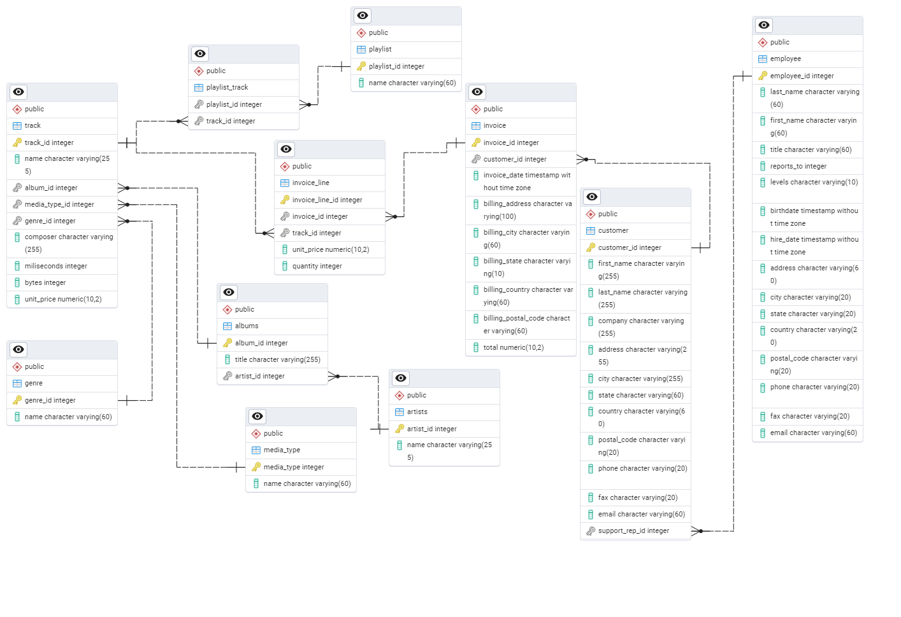

# SQL_Project_Music_Store_Analysis
SQL project to analyze online music store data

This project contains SQL queries, a database schema, and dataset files for practicing PostgreSQL skills.

## Features
**Easy and Moderate SQL Questions**:

### 1.Analyze invoices, customers, and tracks.
- Join tables to fetch useful insights.
- Work with aggregate functions and subqueries.
### 2.Schema Overview

---

## Database and Tools
* Postgre SQL
* PgAdmin4

Schema- Music Store Database  
# Music_Store_Analysis_SQL
